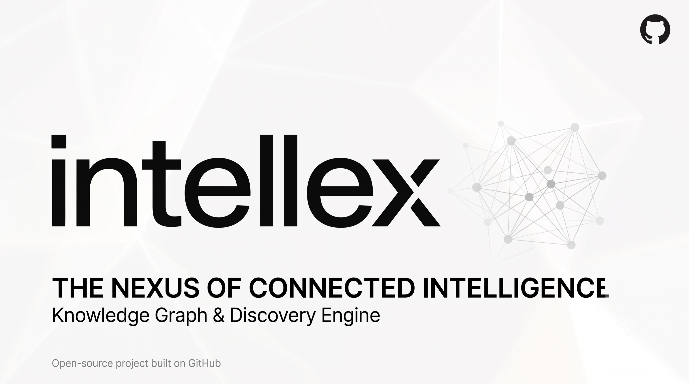

<div align="center">



<br>
<br>


# Intellex

### Transform Information into Intelligence

<p>

A modern <strong>AI-powered News Intelligence Operating System</strong> that transforms fragmented information into structured, searchable, and actionable intelligence.

</p>

<p>


</p>

<p>


</p>

<p>


</p>

---

### Built for researchers, analysts, journalists, students, engineers, and curious minds.

</div>

---

# Why Intellex?

Every day the internet publishes millions of pieces of information.

Articles.

Blogs.

Research papers.

Announcements.

Social posts.

Reports.

Most platforms simply **display** information.

Intellex is designed to **understand** it.

Instead of showing isolated articles, Intellex continuously collects information, extracts entities, groups related stories into evolving events, and presents knowledge through a calm, intelligence-first interface.

Rather than asking:

> **"What was published today?"**

Intellex helps answer:

> **"What is actually happening?"**

---

# Table of Contents

- [Overview](#overview)
- [Features](#features)
- [Architecture](#architecture)
- [Screenshots](#screenshots)
- [Technology Stack](#technology-stack)
- [Repository Structure](#repository-structure)
- [Quick Start](#quick-start)
- [Documentation](#documentation)
- [Roadmap](#roadmap)
- [Contributing](#contributing)
- [Security](#security)
- [License](#license)

---

# Overview

Intellex is a next-generation **News Intelligence Operating System** designed to help people move beyond information consumption toward genuine understanding.

Traditional news platforms organize content by **publication time**.

Intellex organizes information by **meaning**.

Using a modular AI-ready pipeline, Intellex continuously ingests information, enriches it through Natural Language Processing (NLP), clusters related documents into evolving events, and presents the results through a calm, modern intelligence workspace.

The platform is built with scalability in mind, providing a foundation for future capabilities such as semantic search, knowledge graphs, AI-assisted analysis, collaborative intelligence, and timeline exploration.

---

# Core Principles

<table>
<tr>

<td width="33%" align="center">

## 🧠

### Intelligence

Information becomes valuable only when it is organized into meaningful knowledge.

</td>

<td width="33%" align="center">

## 🎯

### Clarity

Interfaces should reduce cognitive load rather than compete for attention.

</td>

<td width="33%" align="center">

## ⚙️

### Engineering

Modular architecture designed for long-term maintainability and extensibility.

</td>

</tr>
</table>

---

# Features

## Current Platform Capabilities (v0.1)

| Feature | Status | Description |
|----------|:------:|-------------|
| Multi-source RSS Ingestion | ✅ | Collect information from configurable RSS feeds |
| Document Normalization | ✅ | Clean and standardize incoming content |
| HTML Entity Decoding | ✅ | Normalize encoded content automatically |
| Entity Extraction | ✅ | Identify people, organizations, locations, and more |
| Keyword Extraction | ✅ | Extract meaningful keywords from documents |
| Event Clustering | ✅ | Group related stories into evolving events |
| Search | ✅ | Search indexed documents and events |
| Documents Explorer | ✅ | Browse all collected documents |
| Event Explorer | ✅ | Explore clustered intelligence |
| Source Analytics | ✅ | Monitor configured information sources |
| Dynamic Feed Management | ✅ | Add, enable, disable, or remove RSS feeds |
| Manual Ingestion Trigger | ✅ | Trigger collection on demand |
| REST API | ✅ | FastAPI-powered backend |
| Responsive Dashboard | ✅ | Modern Next.js interface |
| Settings | ✅ | Manage feeds and ingestion pipeline |

---

# What's Coming Next

| Feature | Planned Version |
|----------|----------------:|
| AI Workspace | 🚧 v0.2 |
| Timeline Intelligence | 🚧 v0.2 |
| Collections | 🚧 v0.2 |
| Semantic Search | 📅 v0.3 |
| Knowledge Graph | 📅 v0.3 |
| AI Summaries | 📅 v0.3 |
| PostgreSQL | 📅 v0.2 |
| Docker Support | 📅 v0.2 |
| Authentication | 📅 v0.5 |
| Team Collaboration | 📅 v0.5 |

---

# Why Intellex?

Most news applications answer:

> **"What is new?"**

Intellex answers:

> **"What matters?"**

Instead of presenting isolated articles, Intellex identifies relationships between documents, allowing users to follow evolving events rather than individual publications.

The goal is not simply to read more information.

The goal is to understand it better.

---

# Design Philosophy

Intellex follows one guiding philosophy:

> **Designed. Never Decorated. Quiet Confidence.**

Every design decision prioritizes understanding over decoration.

Whitespace is intentional.

Typography is intentional.

Motion is subtle.

Information always comes first.

---

# Product Goals

Intellex is being built around five long-term goals.

| Goal | Description |
|------|-------------|
| 📰 Information Collection | Continuously ingest information from diverse sources |
| 🧠 Intelligence Extraction | Transform raw information into structured knowledge |
| 🔍 Discovery | Enable users to uncover hidden relationships |
| 🤖 AI Assistance | Augment human understanding with AI—not replace it |
| 🌍 Scalability | Build a platform capable of supporting future intelligence workflows |

---

# Current Release

<div align="center">

| Version | Status |
|----------|--------|
| **v0.1.0** | ✅ Stable MVP |
| **v0.2** | 🚧 In Development |
| **v1.0** | 🎯 Production Vision |

</div>

---
# Screenshots

> **A calm interface designed to help users understand information rather than simply consume it.**

<p align="center">


</p>

<div align="center">

| Dashboard | Events | Search |
|-----------|--------|--------|
| 🚧 Coming Soon | 🚧 Coming Soon | 🚧 Coming Soon |

</div>

---

# Architecture

Intellex follows a modular pipeline architecture.

Rather than treating articles as isolated documents, the platform continuously transforms incoming information into structured intelligence.

```text
                        ┌────────────────────────────┐
                        │      RSS Sources           │
                        └─────────────┬──────────────┘
                                      │
                                      ▼
                        ┌────────────────────────────┐
                        │      RSS Collector         │
                        └─────────────┬──────────────┘
                                      │
                                      ▼
                        ┌────────────────────────────┐
                        │     Normalization          │
                        └─────────────┬──────────────┘
                                      │
                                      ▼
                        ┌────────────────────────────┐
                        │ Entity & Keyword Extraction│
                        └─────────────┬──────────────┘
                                      │
                                      ▼
                        ┌────────────────────────────┐
                        │     Event Clustering       │
                        └─────────────┬──────────────┘
                                      │
                                      ▼
                        ┌────────────────────────────┐
                        │      SQLite Database       │
                        └─────────────┬──────────────┘
                                      │
                     ┌────────────────┴────────────────┐
                     ▼                                 ▼
           ┌───────────────────┐          ┌───────────────────┐
           │   FastAPI REST    │          │ Background Worker │
           └─────────┬─────────┘          └───────────────────┘
                     │
                     ▼
           ┌────────────────────────────┐
           │     Next.js Frontend       │
           └────────────────────────────┘
```

A complete technical explanation is available here:

📘 **[Architecture Documentation](docs/ARCHITECTURE.md)**

---

# Data Flow

```text
Information Sources

        │

        ▼

 Collection

        │

        ▼

Normalization

        │

        ▼

NLP Processing

        │

        ▼

Event Detection

        │

        ▼

Storage

        │

        ▼

REST API

        │

        ▼

Dashboard
```

---

# Technology Stack

<div align="center">

## Backend


---

## Frontend


</div>

---

# Repository Structure

```text
📦 Intellex
│
├── 📂 assets
│   ├── 📂 banners
│   ├── 📂 diagrams
│   ├── 📂 logo
│   └── 📂 screenshots
│
├── 📂 docs
│   ├── API.md
│   ├── ARCHITECTURE.md
│   ├── DESIGN_SYSTEM.md
│   ├── DEVELOPMENT.md
│   └── PROJECT_VISION.md
│
├── 📂 intellex-backend
│
├── 📂 intellex-frontend
│
├── 📄 README.md
├── 📄 CHANGELOG.md
├── 📄 ROADMAP.md
├── 📄 CONTRIBUTING.md
├── 📄 SECURITY.md
├── 📄 CODE_OF_CONDUCT.md
└── 📄 LICENSE
```

---

# Project Documentation

Everything about Intellex is documented.

| Document | Purpose |
|----------|---------|
| 📘 **Architecture** | System design and architecture |
| 🌐 **API** | REST API documentation |
| 🎨 **Design System** | UI and product philosophy |
| 🛠 **Development Guide** | Engineering workflow |
| 🚀 **Project Vision** | Long-term mission |
| 🗺 **Roadmap** | Future releases |
| 📝 **Changelog** | Release history |

> Intellex treats documentation as part of the product—not an afterthought.

---
# Quick Start

Get Intellex running locally in just a few minutes.

---

<details open>

<summary><strong>📦 Clone the Repository</strong></summary>

```bash
git clone https://github.com/crystalknife/Intellex.git

cd Intellex
```

</details>

---

<details open>

<summary><strong>⚙️ Backend Setup (FastAPI)</strong></summary>

### Navigate to the backend

```bash
cd intellex-backend
```

### Create a virtual environment

```bash
python -m venv venv
```

### Activate the virtual environment

**Windows**

```bash
venv\Scripts\activate
```

**Linux / macOS**

```bash
source venv/bin/activate
```

### Install dependencies

```bash
pip install -r backend/requirements.txt
```

### Configure environment

```bash
copy backend\.env.example backend\.env
```

### Start the backend

```bash
uvicorn backend.app.api.app:app --reload --app-dir .
```

Backend available at:

```
http://localhost:8000
```

</details>

---

<details open>

<summary><strong>💻 Frontend Setup (Next.js)</strong></summary>

Open a new terminal.

```bash
cd intellex-frontend/frontend
```

Install packages

```bash
npm install
```

Start development server

```bash
npm run dev
```

Frontend available at

```
http://localhost:3000
```

</details>

---

# API Documentation

Once the backend is running, FastAPI automatically generates interactive API documentation.

| Tool | URL |
|------|-----|
| Swagger UI | http://localhost:8000/docs |
| ReDoc | http://localhost:8000/redoc |

For architectural details, see:

📘 **docs/API.md**

---

# Local Development Workflow

```text
Clone Repository
        │
        ▼
Backend Setup
        │
        ▼
Frontend Setup
        │
        ▼
Run Intellex
        │
        ▼
Implement Features
        │
        ▼
Test
        │
        ▼
Commit
        │
        ▼
Push
```

---

# Running Intellex

Intellex currently consists of two independent applications.

| Component | Technology | Port |
|-----------|------------|------|
| Backend | FastAPI | 8000 |
| Frontend | Next.js | 3000 |

Both applications should be running simultaneously during development.

---

# Development Commands

## Backend

```bash
uvicorn backend.app.api.app:app --reload --app-dir .
```

---

## Frontend

```bash
npm run dev
```

---

## Production Build

```bash
npm run build
```

---

## Run Tests

```bash
# Backend
pytest

# Frontend
npm test
```

> Test coverage will expand as Intellex evolves.

---

# Environment Variables

Intellex currently uses a lightweight configuration.

Typical environment variables include:

```env
DATABASE_URL=sqlite:///intellex.db

INGESTION_INTERVAL=900

LOG_LEVEL=INFO
```

Additional configuration options will be introduced as new services are added.

---

# Docker

> 🚧 Planned for v0.2

Future releases will provide:

- Docker Compose
- Production containers
- One-command deployment
- Persistent volumes
- Reverse proxy configuration

---

# Development Philosophy

Intellex follows an API-first architecture.

```text
Frontend

↓

REST API

↓

Services

↓

Repositories

↓

Database
```

Business logic belongs in the backend.

The frontend should remain focused on presentation and user interaction.

---

# Current Development Status

| Area | Progress |
|------|----------|
| Backend | 🟢 Stable |
| Frontend | 🟢 Stable |
| Documentation | 🟢 Complete |
| AI Workspace | 🟡 In Progress |
| Timeline | 🟡 Planned |
| Collections | 🟡 Planned |
| Semantic Search | ⚪ Planned |
| Knowledge Graph | ⚪ Planned |

---

> **Tip:** Intellex is under active development. The architecture is intentionally modular so new capabilities can be added without large-scale rewrites.

---

# The Intelligence Pipeline

Intellex transforms fragmented information into structured intelligence through a modular processing pipeline.

Instead of treating every article as an isolated document, Intellex continuously discovers relationships between information sources and organizes them into evolving events.

```text
                 Raw Information
                       │
      ┌────────────────┼────────────────┐
      │                │                │
      ▼                ▼                ▼
  RSS Feeds      News Sources      Future Connectors
      │                │
      └────────────┬───┘
                   ▼
         Information Collection
                   │
                   ▼
        Document Normalization
                   │
                   ▼
     Entity & Keyword Extraction
                   │
                   ▼
          Event Clustering Engine
                   │
                   ▼
          Structured Intelligence
                   │
         ┌─────────┴──────────┐
         ▼                    ▼
    REST API            Future AI Layer
         │                    │
         └─────────┬──────────┘
                   ▼
          Intelligence Workspace
```

---

# Product Philosophy

Intellex is built around a simple belief:

> **Information alone is not intelligence.**

Intelligence emerges when information is:

- Collected
- Organized
- Connected
- Understood

Every feature in Intellex should contribute to one of these four goals.

---

# Guiding Principles

<table>
<tr>

<td width="25%" align="center">

## 🧩

### Organize

Transform fragmented information into structured knowledge.

</td>

<td width="25%" align="center">

## 🔍

### Discover

Reveal relationships that are difficult to see manually.

</td>

<td width="25%" align="center">

## 🧠

### Understand

Help users think more clearly instead of reading more.

</td>

<td width="25%" align="center">

## 🚀

### Scale

Design systems that grow without becoming more complex.

</td>

</tr>
</table>

---

# Why Intellex?

Traditional news platforms answer:

```
"What was published today?"
```

Intellex answers:

```
"What is actually happening?"
```

That difference changes everything.

Instead of navigating individual articles, users explore evolving events, related documents, extracted entities, and future AI-generated insights.

---

# Current Roadmap

```text
v0.1
█████████████████████████████ 100%

Core Intelligence Platform

──────────────────────────────────────────────

v0.2
██████████████░░░░░░░░░░░░░░░ 45%

AI Workspace
Timeline
Collections
Docker
PostgreSQL

──────────────────────────────────────────────

v0.3
█████░░░░░░░░░░░░░░░░░░░░░░░░ 15%

Semantic Search
Knowledge Graph
AI Summaries
Relationship Explorer

──────────────────────────────────────────────

v1.0

Enterprise Intelligence Platform
```

---

# Upcoming Features

<table>

<tr>

<td width="50%">

## 🚧 v0.2

- AI Workspace
- Collections
- Timeline Intelligence
- Docker Support
- PostgreSQL
- Improved Search
- Background Workers
- Better Clustering

</td>

<td width="50%">

## 🔮 v0.3+

- Semantic Search
- Knowledge Graph
- AI Summaries
- Event Evolution
- Relationship Explorer
- Enterprise Connectors
- Plugin System
- Collaboration

</td>

</tr>

</table>

---

# Design Language

Intellex follows one design philosophy:

> **Designed. Never Decorated. Quiet Confidence.**

The interface should disappear behind the information.

Design should support understanding—not compete for attention.

Inspired by:

- Apple
- Linear
- Vercel
- GitHub
- Notion
- Stripe
- Swiss Editorial Design

---

# Long-Term Vision

Intellex is not intended to become another RSS reader.

Nor another AI chatbot.

Nor another note-taking application.

The long-term goal is to build an operating system for intelligence.

One place where information is collected, organized, explored, and understood.

Future intelligence sources may include:

- Research Papers
- Financial Reports
- Government Publications
- Technical Documentation
- Podcasts
- Videos
- Social Platforms
- Enterprise Knowledge Bases

The underlying philosophy remains unchanged:

> **Transform Information into Intelligence.**

---

# Design × Engineering

Intellex is built at the intersection of thoughtful design and robust engineering.

| Design | Engineering |
|---------|-------------|
| Calm interfaces | Modular architecture |
| Editorial layouts | API-first backend |
| Minimal distractions | Scalable services |
| Consistent interactions | Clean separation of concerns |
| Information hierarchy | Extensible processing pipeline |

Neither discipline exists without the other.

---

# Built for Curious Minds

Intellex is designed for people who spend their days understanding information.

Including:

- Researchers
- Journalists
- Engineers
- Students
- Analysts
- Founders
- Investors
- Security Professionals
- Policy Researchers
- Technology Enthusiasts

---
# Documentation Hub

Intellex treats documentation as a first-class part of the project.

Every architectural decision, engineering guideline, and design philosophy is documented to help contributors understand not just **how** the project works—but **why** it was built that way.

| Document | Description |
|-----------|-------------|
| 📘 [Architecture](docs/ARCHITECTURE.md) | Overall system architecture and processing pipeline |
| 🌐 [API](docs/API.md) | REST API overview and endpoints |
| 🎨 [Design System](docs/DESIGN_SYSTEM.md) | UI language, spacing, typography, and interaction principles |
| 🛠️ [Development Guide](docs/DEVELOPMENT.md) | Local development workflow |
| 🚀 [Project Vision](docs/PROJECT_VISION.md) | Long-term mission and philosophy |
| 🗺️ [Roadmap](ROADMAP.md) | Upcoming milestones and planned releases |
| 📝 [Changelog](CHANGELOG.md) | Release history |
| 🤝 [Contributing](CONTRIBUTING.md) | Contribution guidelines |
| 🔒 [Security](SECURITY.md) | Responsible disclosure policy |
| 📜 [Code of Conduct](CODE_OF_CONDUCT.md) | Community standards |

---

# Open Source Philosophy

Intellex is being developed as an open-source platform.

Open source is more than publishing code.

It is about:

- Transparency
- Collaboration
- Learning
- Continuous improvement
- Long-term maintainability

Every contribution—whether code, documentation, design, testing, or discussion—is valuable.

---

# Contributing

We welcome contributors of all experience levels.

There are many ways to contribute:

### 💻 Engineering

- Backend
- Frontend
- API
- Performance
- Testing

### 🎨 Design

- UI/UX
- Icons
- Branding
- Illustrations
- Accessibility

### 📚 Documentation

- Tutorials
- Guides
- API improvements
- Architecture documentation

### 🐛 Quality

- Bug reports
- Testing
- Reproductions
- Suggestions

Before contributing, please read:

- 📘 CONTRIBUTING.md
- 📜 CODE_OF_CONDUCT.md

---

# Repository Workflow

```text
Fork Repository

        │

        ▼

Create Feature Branch

        │

        ▼

Implement Changes

        │

        ▼

Run Tests

        │

        ▼

Commit

        │

        ▼

Open Pull Request

        │

        ▼

Code Review

        │

        ▼

Merge
```

---

# Development Principles

When contributing to Intellex, we prioritize:

### Simplicity

Prefer simple solutions over clever ones.

---

### Readability

Code is read more often than it is written.

Optimize for maintainability.

---

### Modularity

Components should have a single responsibility.

---

### Consistency

Follow established architecture and coding patterns.

---

### Documentation

Major features should include corresponding documentation updates.

---

# Issue Tracking

Intellex uses GitHub Issues for:

- Bug Reports
- Feature Requests
- Enhancements
- Discussions
- Technical Debt
- Roadmap Planning

Well-described issues help maintain project quality.

---

# Community

Whether you're fixing a typo, proposing a feature, or building an entirely new subsystem—

you're helping Intellex become better.

Questions, discussions, and constructive feedback are always welcome.

---

# Security

If you discover a security vulnerability, please **do not** create a public issue.

Instead, follow the responsible disclosure process described in:

🔒 **SECURITY.md**

---

# License

Intellex is released under the **MIT License**.

You are free to:

- Use
- Modify
- Distribute
- Fork
- Build upon

while retaining the original license notice.

See:

📜 **LICENSE**

---

# Project Status

<div align="center">

| Area | Status |
|-------|--------|
| Core Platform | ✅ Stable |
| Documentation | ✅ Complete |
| Frontend | ✅ Stable |
| Backend | ✅ Stable |
| AI Features | 🚧 In Development |
| Community | 🌱 Growing |

</div>

---

# Maintainer

<div align="center">

## Balasubrahmanya A G

Computer Science Engineer • AI Enthusiast • Open Source Builder

*"Building systems that help people understand information better."*

</div>

---

# The Road Ahead

Intellex is still in its early stages.

The current platform focuses on collecting, organizing, and exploring information.

The long-term vision extends far beyond news.

Future versions will support intelligence workflows across multiple domains.

```text
Today
│
├── RSS Intelligence
├── Event Clustering
├── Search
├── Source Management
│
▼

Tomorrow

├── AI Workspace
├── Semantic Search
├── Timeline Intelligence
├── Collections
├── Knowledge Graph
├── AI Summaries
├── Enterprise Connectors
├── Multi-user Collaboration
├── Plugins
└── Autonomous Intelligence Agents
```

---

# Future Ecosystem

Intellex is designed around an extensible architecture.

Future data sources may include:

| Source | Planned |
|---------|:-------:|
| RSS Feeds | ✅ |
| Research Papers | 🚧 |
| GitHub | 🚧 |
| Hacker News | 🚧 |
| Reddit | 🚧 |
| YouTube | 📅 |
| Podcasts | 📅 |
| PDFs | 📅 |
| Enterprise Documents | 📅 |
| Slack | 📅 |
| Notion | 📅 |
| Google Drive | 📅 |

---

# AI Roadmap

Intellex has been intentionally designed to be **AI-ready**.

Future AI capabilities include:

- Natural language querying
- Semantic search
- Multi-document summarization
- Retrieval-Augmented Generation (RAG)
- Event evolution analysis
- Relationship discovery
- Knowledge graph exploration
- Personalized intelligence assistant
- Research copilots
- Autonomous monitoring agents

These features will build on the existing modular architecture without requiring a complete redesign.

---

# Engineering Philosophy

Intellex favors long-term maintainability over short-term convenience.

Every major architectural decision is evaluated against four principles:

| Principle | Goal |
|-----------|------|
| Simplicity | Reduce unnecessary complexity |
| Scalability | Support future growth |
| Maintainability | Keep code understandable |
| Extensibility | Allow new features without rewrites |

---

# Inspiration

Intellex takes inspiration from products that combine thoughtful engineering with exceptional user experience.

Including:

- 🍎 Apple
- ▲ Vercel
- ⚡ Linear
- 🐙 GitHub
- 📝 Notion
- 💳 Stripe
- 🎨 Swiss Editorial Design

Rather than copying them, Intellex applies similar principles:

- Calm interfaces
- Strong typography
- Minimal visual noise
- Performance-first engineering
- Long-term maintainability

---

# Why Open Source?

Intellex is open source because intelligence should be collaborative.

Open development encourages:

- Better ideas
- Better architecture
- Better testing
- Better documentation
- Better software

Every issue opened, pull request submitted, or discussion started helps move the project forward.

---

# Acknowledgements

Special thanks to the open-source ecosystem that makes projects like Intellex possible.

This project builds upon outstanding technologies including:

- Python
- FastAPI
- Next.js
- React
- TypeScript
- Tailwind CSS
- SQLAlchemy
- SQLite
- spaCy
- APScheduler
- TanStack Query
- Framer Motion
- shadcn/ui

Without these communities, Intellex would not exist.

---

# Support the Project

If you find Intellex useful:

⭐ Star the repository

🐛 Report bugs

💡 Suggest ideas

🤝 Contribute

📢 Share the project

Every contribution helps Intellex improve.

---

<div align="center">

## Transform Information into Intelligence.

Information is abundant.

Understanding is rare.

Intellex exists to bridge that gap.

<br>

**Designed. Never Decorated. Quiet Confidence.**

<br><br>

Made with ❤️ using Python, FastAPI, Next.js, TypeScript, and a passion for building thoughtful software.

</div>

---

# Frequently Asked Questions

<details>

<summary><strong>Why build Intellex instead of another RSS reader?</strong></summary>

Intellex is not intended to replace RSS readers.

RSS readers organize information chronologically.

Intellex organizes information semantically.

Instead of presenting hundreds of disconnected articles, Intellex groups related documents into evolving events, making it easier to understand what is happening rather than simply what was published.

</details>

---

<details>

<summary><strong>Is Intellex an AI chatbot?</strong></summary>

No.

Artificial Intelligence is only one component of the long-term vision.

Intellex focuses first on collecting, organizing, and structuring information.

Future AI capabilities will augment human reasoning rather than replace it.

</details>

---

<details>

<summary><strong>Can I add my own RSS feeds?</strong></summary>

Yes.

The current version supports dynamic feed management through the Settings page.

Feeds can be:

- Added
- Enabled
- Disabled
- Removed

without modifying the source code.

</details>

---

<details>

<summary><strong>Does Intellex support Docker?</strong></summary>

Docker support is planned for the v0.2 release.

Future versions will include:

- Docker Compose
- Multi-container setup
- Production deployment
- Reverse proxy configuration

</details>

---

<details>

<summary><strong>Will Intellex support LLMs?</strong></summary>

Yes.

The architecture has been designed to support future integration with:

- OpenAI
- Ollama
- Anthropic Claude
- Google Gemini
- Local LLMs
- Hugging Face models

without requiring major architectural changes.

</details>

---

# Troubleshooting

## Backend won't start

Check that:

- Python version is supported
- Virtual environment is activated
- Dependencies are installed
- `.env` file exists

---

## Frontend cannot connect to backend

Verify:

```text
Backend
↓

http://localhost:8000

↓

Frontend

http://localhost:3000
```

Ensure the backend is running before starting the frontend.

---

## RSS feeds aren't updating

Try the following:

- Verify the feed URL is valid.
- Trigger manual ingestion from **Settings**.
- Check internet connectivity.
- Review backend logs for ingestion errors.

---

## Build errors

Common fixes:

```bash
npm install

npm run build
```

Backend:

```bash
pip install -r backend/requirements.txt
```

---

# Engineering Standards

Intellex follows several engineering principles to maintain long-term code quality.

## Backend

- Layered Architecture
- Repository Pattern
- Service Layer
- Dependency Injection where appropriate
- REST-first API Design

---

## Frontend

- Component-based architecture
- Reusable UI primitives
- Type-safe API integration
- Responsive layouts
- Minimal client-side complexity

---

## Documentation

Documentation should evolve alongside the codebase.

Whenever introducing a major feature, update the relevant documentation.

---

# Coding Philosophy

Good software should be:

- Easy to read
- Easy to test
- Easy to extend
- Difficult to misuse

Intellex favors maintainability over cleverness.

---

# Release Strategy

Intellex follows a milestone-based development model.

```text
Planning

↓

Implementation

↓

Verification

↓

Documentation

↓

Release

↓

Feedback

↓

Next Milestone
```

Large features are developed in cohesive batches before stabilization and testing.

---

# Repository Health

Current project goals:

| Goal | Status |
|------|:------:|
| Clean Architecture | ✅ |
| Modular Backend | ✅ |
| Responsive Frontend | ✅ |
| Documentation | ✅ |
| Testing | 🚧 |
| Docker | 🚧 |
| AI Workspace | 🚧 |
| Timeline | 🚧 |
| Collections | 🚧 |

---

# Compatibility

| Platform | Status |
|----------|:------:|
| Windows | ✅ |
| Linux | ✅ |
| macOS | ✅ |

---

# Versioning

Intellex follows Semantic Versioning.

```text
MAJOR.MINOR.PATCH
```

Example:

```
v0.1.0
```

Future releases will be documented in:

- CHANGELOG.md
- GitHub Releases

---

# Repository Goals

This repository aims to demonstrate:

- Modern Software Architecture
- Clean Code Practices
- Thoughtful Product Design
- AI-Ready Engineering
- Open Source Collaboration

Rather than being just another portfolio project, Intellex is intended to evolve into a real, production-grade intelligence platform.

---

# Beyond v1.0

Intellex is being built with a long-term vision that extends well beyond traditional news aggregation.

The architecture has been intentionally designed so future intelligence capabilities can be introduced without requiring large-scale rewrites.

Possible future domains include:

- 📚 Scientific Literature
- 💹 Financial Intelligence
- 🏛 Government Publications
- 🌐 Open Data
- 🧬 Research Knowledge
- 🏢 Enterprise Knowledge
- 🎥 Multimedia Intelligence
- 🎙 Podcasts
- 📄 PDF Intelligence
- 🛰 Real-time Event Monitoring

The goal is to build a unified platform capable of transforming fragmented information into connected knowledge.

---

# Research Directions

Intellex provides a foundation for experimenting with modern information retrieval and artificial intelligence techniques.

Future exploration areas include:

| Research Area | Status |
|--------------|:------:|
| Semantic Search | 🚧 |
| Retrieval-Augmented Generation (RAG) | 🚧 |
| Knowledge Graph Construction | 📅 |
| Event Evolution Tracking | 📅 |
| Multi-Document Summarization | 📅 |
| Entity Linking | 📅 |
| Vector Search | 📅 |
| Hybrid Search | 📅 |
| Autonomous Monitoring Agents | 🔮 |

These capabilities are planned as evolutionary additions rather than complete architectural replacements.

---

# Community Vision

Great software is rarely built alone.

Intellex aims to become a collaborative project where engineers, designers, researchers, and students can experiment with modern intelligence systems together.

Whether your interests are:

- Artificial Intelligence
- Backend Engineering
- Frontend Development
- User Experience
- Information Retrieval
- Natural Language Processing
- Data Engineering
- Distributed Systems

there is room to contribute.

---

# Design Manifesto

Intellex follows a few simple rules.

### Information first.

Interfaces should never compete with the information they present.

---

### Every interaction should reduce complexity.

Technology should make understanding easier—not harder.

---

### Calm software lasts longer.

Minimalism is not about removing features.

It is about removing unnecessary friction.

---

### Build systems, not demos.

Every feature should be implemented with long-term maintainability in mind.

---

# Built With

Intellex stands on the shoulders of incredible open-source communities.

### Backend

- Python
- FastAPI
- SQLAlchemy
- SQLite
- spaCy
- APScheduler

### Frontend

- Next.js
- React
- TypeScript
- Tailwind CSS
- TanStack Query
- Axios
- Framer Motion
- shadcn/ui

### Development

- Git
- GitHub
- VS Code
- npm
- pip

Special thanks to every open-source maintainer whose work makes projects like Intellex possible.

---

# Ways to Contribute

There are many ways to help Intellex grow.

## Engineering

- Backend Features
- Frontend Features
- Testing
- Performance
- API Improvements

## Product

- UX Feedback
- Feature Requests
- Design Improvements

## Documentation

- Tutorials
- Examples
- Guides
- Architecture

## Community

- Open Issues
- Answer Questions
- Share the Project
- Report Bugs

Every contribution—no matter how small—helps move the project forward.

---

# If You Like Intellex

If this project interests you, consider supporting it by:

⭐ Starring the repository

🍴 Forking the project

🐛 Reporting bugs

💡 Suggesting new ideas

🤝 Contributing code

📢 Sharing the project

Your support helps improve Intellex for everyone.

---

# Final Mission

<div align="center">

## The internet doesn't have an information problem.

### It has an understanding problem.

Intellex exists to bridge that gap.

By transforming isolated information into connected intelligence, we hope to help people spend less time searching and more time understanding.

<br>

### **Transform Information into Intelligence.**

</div>

---

---

# Release Information

| Release | Status | Notes |
|----------|:------:|------|
| **v0.1.0** | ✅ Released | Core Intelligence Platform |
| **v0.2.0** | 🚧 In Development | Intelligence Workspace |
| **v0.3.0** | 📅 Planned | AI & Semantic Intelligence |
| **v1.0.0** | 🎯 Vision | Production Intelligence Platform |

---

# Repository Standards

Intellex follows modern software engineering practices.

✅ Modular Architecture

✅ API-First Development

✅ Documentation-Driven Engineering

✅ Semantic Versioning

✅ Clean Git History

✅ Open Source Development

✅ Continuous Improvement

---

# Project Metrics

Current repository focus:

| Category | Current Goal |
|-----------|--------------|
| Architecture | Stable & Modular |
| Backend | Production-ready foundation |
| Frontend | Modern Intelligence Workspace |
| Documentation | Comprehensive |
| Performance | Continuous Optimization |
| Testing | Expanding Coverage |
| AI Integration | Active Development |

---

# Philosophy

Intellex is guided by a simple idea:

> **Technology should help people think more clearly.**

Every architectural decision, interface, and feature should reduce complexity rather than increase it.

Information is abundant.

Understanding is rare.

Intellex exists to bridge that gap.

---

# Credits

Intellex is an independent open-source project created and maintained by:

<div align="center">

## Balasubrahmanya A G

Computer Science Engineer • AI Enthusiast • Open Source Builder

</div>

Special thanks to the maintainers and communities behind the incredible open-source technologies that make Intellex possible.

---

# Connect

If you're interested in discussing:

- Artificial Intelligence
- Information Retrieval
- News Intelligence
- Software Architecture
- Product Design
- Open Source

feel free to open an Issue or start a Discussion on this repository.

Constructive feedback and thoughtful ideas are always welcome.

---

# Star History

If Intellex helps you, consider giving the repository a ⭐.

It helps more people discover the project and supports future development.

---

<div align="center">

## Intellex

### Transform Information into Intelligence.

<br>


<br><br>

**Designed. Never Decorated. Quiet Confidence.**

<br>

*A modern, open-source News Intelligence Operating System.*

<br><br>

Made with ❤️ using

**Python • FastAPI • Next.js • React • TypeScript**

<br><br>

Copyright © 2026 Balasubrahmanya A G

Licensed under the MIT License.

</div>


